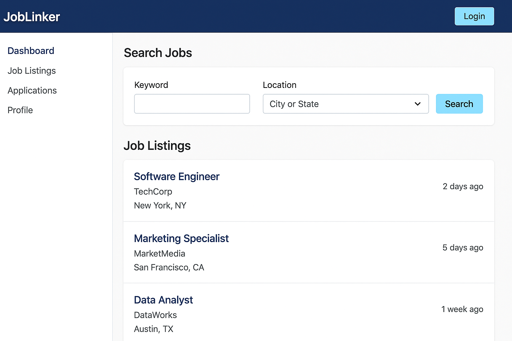

# JobLinker

JobLinker is a full-stack job portal application that allows job seekers to browse and apply for jobs, and employers to post job listings, view applications, and manage hiring.

---

## 🚀 Tech Stack

### Backend
- Java 17
- Spring Boot
- Spring Security (JWT Auth)
- Spring Data JPA
- MySQL
- Docker
- Maven

### Frontend
- React.js
- Axios
- React Router
- Form Validation

### DevOps
- GitHub Actions (CI/CD)
- Docker Compose

---

## 📁 Project Structure

```
JobLinker_Complete_Project/
├── backend/                # Spring Boot API
│   ├── src/main/java/com/joblinker/
│   ├── resources/
│   └── pom.xml
├── frontend/               # React Client
│   ├── public/
│   │   └── index.html
│   ├── src/
│   │   ├── index.js
│   │   └── App.js
│   └── package.json
├── docker-compose.yml
└── .github/workflows/ci-cd.yml
```

---

## ⚙️ Setup Instructions

### 1. Clone the Repo
```bash
git clone https://github.com/your-username/joblinker.git
cd joblinker
```

### 2. Run with Docker
```bash
docker-compose up --build
```

> Make sure MySQL is configured to accept connections on port 3306.

---

## 🛡️ Authentication

- JWT-based login
- Role-based access: Employer vs Job Seeker

---

## 💡 Features

- Register/Login for both Employers and Job Seekers
- Job posting and job application
- Resume upload functionality
- Role-specific dashboards
- Protected routes and secure APIs
- CI/CD integration with GitHub Actions

---

## 📸 Screenshots




---

## 📬 Contact

Created by **@skv1627** — feel free to reach out!

